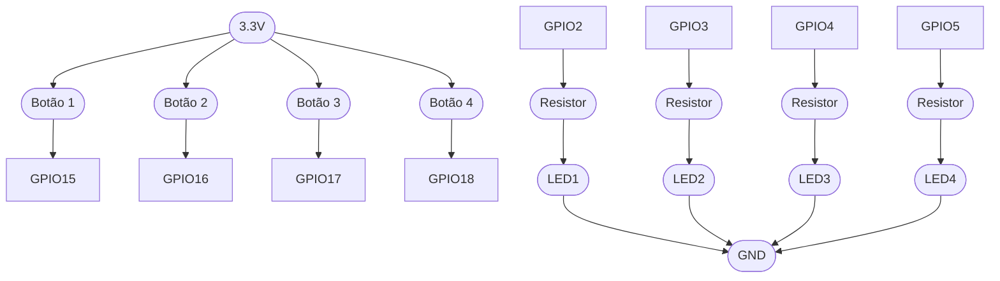
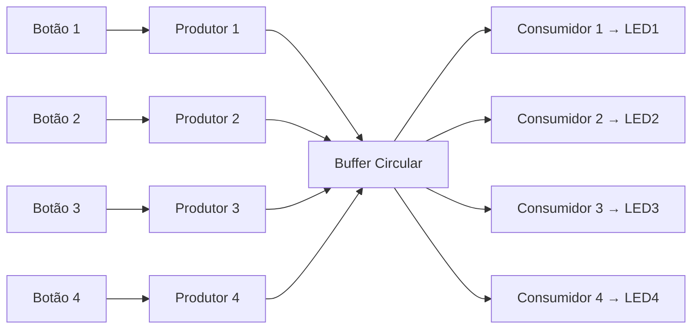
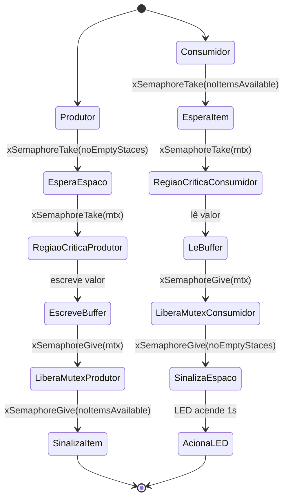

# Produtor/Consumidor - FreeRTOS ⛓️‍💥 (Versão com 4 Botões e 4 LEDs)

 Este projeto demonstra o uso de **semáforos de contagem** e **mutex** do `FreeRTOS` no `Arduino/ESP32` para gerenciar concorrência entre múltiplas tarefas **produtoras** (controladas por botões) e múltiplas tarefas **consumidoras** (que acendem LEDs).
 
 A lógica central implementa um **buffer circular protegido**, onde os produtores escrevem valores e os consumidores retiram valores, garantindo que o acesso ao recurso compartilhado seja **seguro contra condições de corrida**.

## 📌 Objetivo
- Utilizar um **mutex** e **semáforos de contagem** para proteger o **buffer compartilhado**.  
- Cada produtor insere números no buffer (quando um botão é pressionado).  
- Cada consumidor retira números do buffer e acende um LED correspondente.  
- **Sem uso de filas (queues)** do FreeRTOS.


## 🚀 Como Executar

1. Instale a `Arduino IDE (ou PlatformIO)`.

2. Conecte a placa `ESP32`.

3. Monte os botões e LEDs conforme o diagrama elétrico.

4. Compile e envie o código.

5. Abra o Serial Monitor `115200 baud`.

## 📂 Estrutura do Código

- *producer(void *parameters)** → Lê o botão e escreve no buffer.

- *consumer(void *parameters)** → Lê do buffer e acende o LED.

- *setup()** → Configura GPIOs, semáforos e cria tarefas.

- *loop()** → Apenas libera CPU (vTaskDelay).

## ⚙️ Conceitos Utilizados
- **Buffer Circular (`buf`)**  
  Estrutura que armazena dados de forma contínua, reiniciando no índice zero ao atingir o limite.  
  - `head` → índice de escrita  
  - `tail` → índice de leitura  

- **Mutex (`mtx`)**  
  Garante que apenas uma tarefa por vez acesse o buffer.  

- **Semáforo de Contagem**  
  - `noEmptyStaces`: controla quantos espaços vazios ainda existem no buffer.  
  - `noItemsAvailable`: controla quantos itens já estão disponíveis para leitura.  

- **Produtores (`producer`)**  
  Ativados quando um **botão** é pressionado.  
  - Escrevem no buffer.  
  - Liberam `noItemsAvailable`.  

- **Consumidores (`consumer`)**  
  - Esperam até que haja dados (`noItemsAvailable`).  
  - Leem do buffer e liberam espaço (`noEmptyStaces`).  
  - Acendem o LED correspondente.  


## 🔧 Hardware Necessário
- **Placa**: ESP32 (ou Arduino compatível com FreeRTOS).  
- **Botões (x4)** com **pull-down** interno habilitado.  
- **LEDs (x4)** com resistores de **220 Ω a 330 Ω**.  

### 🖲️ Mapeamento de Pinos

| Componente | Pino ESP32 |
|------------|------------|
| Botão 1    | GPIO 15    |
| Botão 2    | GPIO 16    |
| Botão 3    | GPIO 17    |
| Botão 4    | GPIO 18    |
| LED 1      | GPIO 2     |
| LED 2      | GPIO 3     |
| LED 3      | GPIO 4     |
| LED 4      | GPIO 5     |


## 🔌 Circuito (Mermaid Flowchart)



## 📜 Fluxo Produtor → Consumidor (Mermaid)


## 🔄 Diagrama de Estados (Semáforos + Mutex)


## 🖥️ Saída Esperada (Serial Monitor)
```
--- FreeRTOS Semaphore Alternate Solution ---
Produces: 0
Produces: 1
Consume: 0
Consume: 1
```
## 👩‍💻 Autores

  - **Gabriella Arévalo Marques**  
    📧 [gabriellaarevalomarques@gmail.com](mailto:gabriellaarevalomarques@gmail.com)

  - **Hebert Allan Kubis**  
    📧 [herbertkubis15@gmail.com](mailto:herbertkubis15@gmail.com)

## 🔗 Repositório

👉 [Acesse no GitHub](https://github.com/2005HAK/STR.git) 
<p align="center">
  <!-- ESP32 -->
  
  &nbsp;&nbsp;&nbsp;
    <!-- FreeRTOS -->
  
  &nbsp;&nbsp;&nbsp;
  <!-- C Language -->
  
</p>


